# AI Talent Intelligence Platform — Wish-to-Team

An AI-powered platform that transforms a Product Owner's natural language "wish" into a fully assembled, role-matched team — automatically.

---

## Overview

The **Wish-to-Team** system bridges the gap between high-level product ideas and the right human talent. A Product Owner simply writes a wish or idea in natural language, and the platform intelligently decomposes it into tasks, identifies required skills, and matches the best candidates to form an optimal team.

---

## Architecture

The platform is built as a multi-layer AI pipeline:

### Layer 0 — Product Owner Input
- The Product Owner writes a **wish / idea in natural language**

### Layer 1 — Wish Parser *(LLM)* `NEW`
- **Intent extraction** and **domain classification**
- Understands what the PO wants and categorizes it

### Layer 2 — Domain Expert Consultant *(LLM)* `NEW`
- Consults relevant domain knowledge
- Refines and validates the parsed intent

### Layer 3 — Task Decomposer `NEW`
- Breaks the wish into concrete subtasks across three tracks:
  - **Frontend** — UI/UX tasks
  - **Backend** — API & logic tasks
  - **Data/ML** — Data engineering & model tasks

### Layer 4 — Skill Extractor *(LLM)*
- Extracts required skills per task:
  - **Frontend Skills** — e.g. React, TypeScript
  - **Backend Skills** — e.g. Python, FastAPI
  - **ML Skills** — e.g. NLP, Vector DBs

### Layer 5 — Candidate Ranker
- Ranks candidates based on skill match and availability

### Layer 6 — Role Fit Scorer *(LLM)*
- Scores each candidate's fit for specific roles using AI reasoning

### Layer 7 — Team Composer
- Assembles the final optimal team from ranked and scored candidates

### Layer 8 — Output
- **Team Proposal** — Recommended team with role assignments
- **Skill Gap Report** — Identifies missing skills or roles to hire for

---

##  Key Features

-  **Natural Language Input** — No forms or structured data needed from the PO
-  **LLM-Powered Reasoning** — Multiple AI agents handle parsing, scoring, and composition
-  **Multi-Domain Support** — Frontend, Backend, and Data/ML tracks
-  **Skill Gap Analysis** — Highlights gaps for hiring or upskilling
-  **End-to-End Automation** — From wish to team in one pipeline

---

## Tech Stack

| Layer | Technology |
|-------|-----------|
| LLM Agents | Claude / OpenAI |
| Backend | Python, FastAPI |
| Frontend | React, TypeScript |
| ML / Embeddings | NLP, Vector DBs |
| Orchestration | LangChain / custom pipeline |

---

##  Project Structure

```
talent-intelligence/
├── wish_parser/          # Layer 1: NL intent extraction
├── domain_expert/        # Layer 2: Domain consultation
├── task_decomposer/      # Layer 3: Task breakdown
├── skill_extractor/      # Layer 4: Skill identification
├── candidate_ranker/     # Layer 5: Candidate ranking
├── role_fit_scorer/      # Layer 6: Role fit scoring
├── team_composer/        # Layer 7: Team assembly
├── outputs/              # Team proposals & skill gap reports
├── assets/               # Architecture diagrams & visuals
└── README.md
```

---

## Getting Started

```bash
# Clone the repo
git clone https://github.com/gpriya-datascientist/talent_intelligence.git
cd talent_intelligence

# Install dependencies
pip install -r requirements.txt

# Run the pipeline
python main.py --wish "I want to build a real-time recommendation engine"
```

---

## License

MIT License — see [LICENSE](LICENSE) for details.

---

##  Author

**Gpriya** — [@gpriya-datascientist](https://github.com/gpriya-datascientist)
